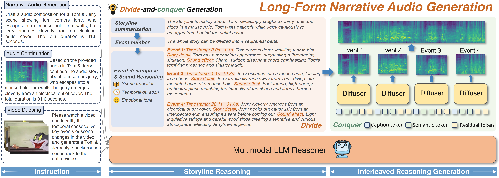
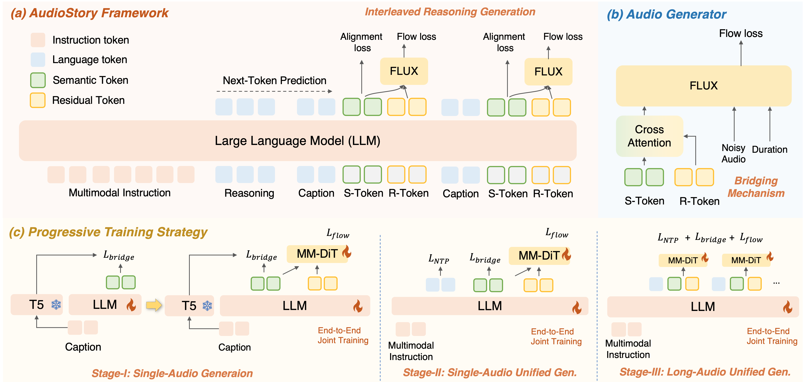

# AudioStory: Generating Long-Form Narrative Audio with Large Language Models

**[Yuxin Guo<sup>1,2</sup>](https://scholar.google.com/citations?user=x_0spxgAAAAJ&hl=en), 
[Teng Wang<sup>2,&#9993;</sup>](http://ttengwang.com/), 
[Yuying Ge<sup>2</sup>](https://geyuying.github.io/), 
[Shijie Ma<sup>1,2</sup>](https://mashijie1028.github.io/), 
[Yixiao Ge<sup>2</sup>](https://geyixiao.com/), 
[Wei Zou<sup>1</sup>](https://people.ucas.ac.cn/~zouwei),
[Ying Shan<sup>2</sup>](https://scholar.google.com/citations?user=4oXBp9UAAAAJ&hl=en)**
<br>
<sup>1</sup>Institute of Automation, CAS
<sup>2</sup>ARC Lab, Tencent PCG
<br>


## 📖 Release

[8/18] 🔥🔥 We release the inference code!

[8/18] 🔥🔥 We release our demo videos!


## 🔎 Introduction



✨ **TL; DR: We propose a model for long-form narrative audio generation built upon a unified understanding–generation framework, capable of handling video dubbing, audio continuation, and long-form narrative audio synthesis.**

Recent advances in text-to-audio (TTA) generation excel at synthesizing short audio clips but struggle with long-form narrative audio, which requires temporal coherence and compositional reasoning. To address this gap, we propose AudioStory, a unified framework that integrates large language models (LLMs) with TTA systems to generate structured, long-form audio narratives. AudioStory possesses strong instruction-following reasoning generation capabilities. It employs LLMs to decompose complex narrative queries into temporally ordered sub-tasks with contextual cues, enabling coherent scene transitions and emotional tone consistency. AudioStory has two appealing features: 

1) Decoupled bridging mechanism: AudioStory disentangles LLM-diffuser collaboration into two specialized components—a bridging query for intra-event semantic alignment and a consistency query for cross-event coherence preservation.
2) End-to-end training: By unifying instruction comprehension and audio generation within a single end-to-end framework, AudioStory eliminates the need for modular training pipelines while enhancing synergy between components. 
    Furthermore, we establish a benchmark AudioStory-10K, encompassing diverse domains such as animated soundscapes and natural sound narratives.

Extensive experiments show the superiority of AudioStory on both single-audio generation and narrative audio generation, surpassing prior TTA baselines in both instruction-following ability and audio fidelity.


## ⭐ Demos

### 1. Video Dubbing (Tom & Jerry)

<table class="center">
  <td><video src="https://github.com/user-attachments/assets/f06b5999-6649-44d3-af38-63fdcecd833c"></video></td>
  <td><video src="https://github.com/user-attachments/assets/17727c2a-bfea-4252-9aa8-48fc9ac33500"></video></td>
  <td><video src="https://github.com/user-attachments/assets/09589d82-62c9-47a6-838a-5a62319f35e2"></video></td>
  <tr>
  <td style="text-align:center;" width="320">"Jerry escapes from Tom at a dining table using quick, clever maneuvers and using a spoon and a pot lid to knock Tom unconscious, amidst dramatic orchestral music."</td>
  <td style="text-align:center;" width="320">"Tom the cat follows a trail of white powder, sneaks up on a yellow cloth he believes is hiding something, and then proceeds to violently smash a book down upon it."</td>
  <td style="text-align:center;" width="320">"At the beach, Jerry pranks Tom by swapping his sugar with sand, and when Tom tries to retaliate by spitting a mouthful of water at him, he accidentally soaks a nearby female cat instead."</td>
  <tr>
</table >


### 2. Video Dubbing (Other domain videos to Tom & Jerry style audios)

<table class="center">
  <td><video src="https://github.com/user-attachments/assets/34e19f06-3b30-4438-a817-9e131af410f3"></video></td>
  <td><video src="https://github.com/user-attachments/assets/4a6de0c6-ef50-4cc3-b31b-d873af6fdf79"></video></td>
  <td><video src="https://github.com/user-attachments/assets/76f7f5de-42c6-475a-853c-5e2ba11ab7b2"></video></td>
  <tr>
  <td style="text-align:center;" width="320">"Snoopy."</td>
  <td style="text-align:center;" width="320">"Nezha."</td>
  <td style="text-align:center;" width="320">"Nezha."</td>
  <tr>
  <td><video src="https://github.com/user-attachments/assets/74415b54-0432-4b0f-9afb-9f2ecf0a80f2"></video></td>
  <td><video src="https://github.com/user-attachments/assets/5141f15b-f2a9-413b-bac1-3c89d61c75dc"></video></td>
  <td><video src="https://github.com/user-attachments/assets/d0cfa875-4637-461c-a8e8-416407a7640c"></video></td>
  <tr>
  <td style="text-align:center;" width="320">"We Bare Bears."</td>
  <td style="text-align:center;" width="320">"Miffy."</td>
  <td style="text-align:center;" width="320">"Donald Duck."</td>
  <tr>
  <td><video src="https://github.com/user-attachments/assets/5c801b5e-ce74-42a2-b8cf-3325ab0d7c4a"></video></td>
  <td><video src="https://github.com/user-attachments/assets/5c9ed7e9-527e-4163-a19b-ffa56ab034dc"></video></td>
  <td><video src="https://github.com/user-attachments/assets/5d603a4a-bf45-4ce9-81a3-62950ea89e99"></video></td>
  <tr>
  <td style="text-align:center;" width="320">"Sora Videos from Official Website."</td>
  <td style="text-align:center;" width="320">"Sora Videos from Official Website."</td>
  <td style="text-align:center;" width="320">"Pets with Tom & Jerry bgm."</td>
  <tr>
</table >


### 3. Text-to-Audio (Long Narrative)

<table class="center">
  <td><audio src="https://github.com/user-attachments/assets/8426c014-0a53-493a-b6f3-33e883749ccc)"></video></td>
  <td><audio src="https://github.com/user-attachments/assets/996e1e98-a300-42d1-a5b6-83957356d515)"></video></td>
  <td><audio src="https://github.com/user-attachments/assets/efbf7538-783f-4d1b-bc4b-9051bfb8fc7a)"></video></td>
  <tr>
  <td style="text-align:center;" width="320">"Develop a comprehensive audio that fully represents jake shimabukuro performs a complex ukulele piece in a studio, receives applause, and discusses his career in an interview.
"</td>
  <td style="text-align:center;" width="320">"Develop a comprehensive audio that fully represents a fire truck leaves the station with sirens blaring, signaling an emergency response, and drives away."</td>
  <td style="text-align:center;" width="320">"Understand the input audio, infer the subsequent events, and generate the continued audio of the coach giving basketball lessons to the players."</td>
  <tr>
</table >


## 🔎 Methods



To achieve effective instruction-following audio generation, the ability to understand the input instruction or audio stream and reason about relevant audio sub-events is essential. To this end,  AudioStory adopts a unified understanding-generation framework (Fig.). Specifically, given textual instruction or audio input, the LLM analyzes and decomposes it into structured audio sub-events with context. Based on the inferred sub-events, the LLM performs **interleaved reasoning generation**, sequentially producing captions, semantic tokens, and residual tokens for each audio clip. These two types of tokens are fused and passed to the DiT, effectively bridging the LLM with the audio generator. Through progressive training, AudioStory ultimately achieves both strong instruction comprehension and high-quality audio generation.


## 🔩 Installation

### Dependencies

* Python >= 3.10 (Recommend to use [Anaconda](https://www.anaconda.com/download/#linux))
* [PyTorch >=2.1.0](https://pytorch.org/)
* NVIDIA GPU + [CUDA](https://developer.nvidia.com/cuda-downloads)

### Installation

```
git clone https://github.com/TencentARC/AudioStory.git
cd AudioStory
conda create -n audiostory python=3.10 -y
conda activate audiostory
bash install_audiostory.sh
```


## 📊 Evaluation

### inference

```
python evaluate/inference.py --model_path /path/to/ckpt --guidance 4.0 --save_folder_name audiostory --total_duration 50
```


## 🔋 Acknowledgement

When building the codebase of continuous denosiers, we refer to [SEED-X](https://github.com/AILab-CVC/SEED-X) and [TangoFlux](https://github.com/declare-lab/TangoFlux). Thanks for their wonderful projects.


## 📆 TO DO

- [ ] Release our gradio demo.
- [ ] Release checkpoints of AudioStory.
- [ ] Release training codes of all three stages.


## 📜 License

This repository is under the [Apache 2 License](https://github.com/mashijie1028/Gen4Rep/blob/main/LICENSE).


## 📚 BibTeX

```
@misc{guo2025audiostory,
      title={AudioStory: Generating Long-Form Narrative Audio with Large Language Models}, 
      author={Yuxin Guo and Teng Wang and Yuying Ge and Shijie Ma and Yixiao Ge and Wei Zou and Ying Shan},
      year={2025},
      eprint={2508.20088},
      archivePrefix={arXiv},
      primaryClass={cs.CV},
      url={https://arxiv.org/abs/2508.20088}, 
}
```


## 📧 Contact

If you have further questions, feel free to contact me: guoyuxin2021@ia.ac.cn

Discussions and potential collaborations are also welcome.
